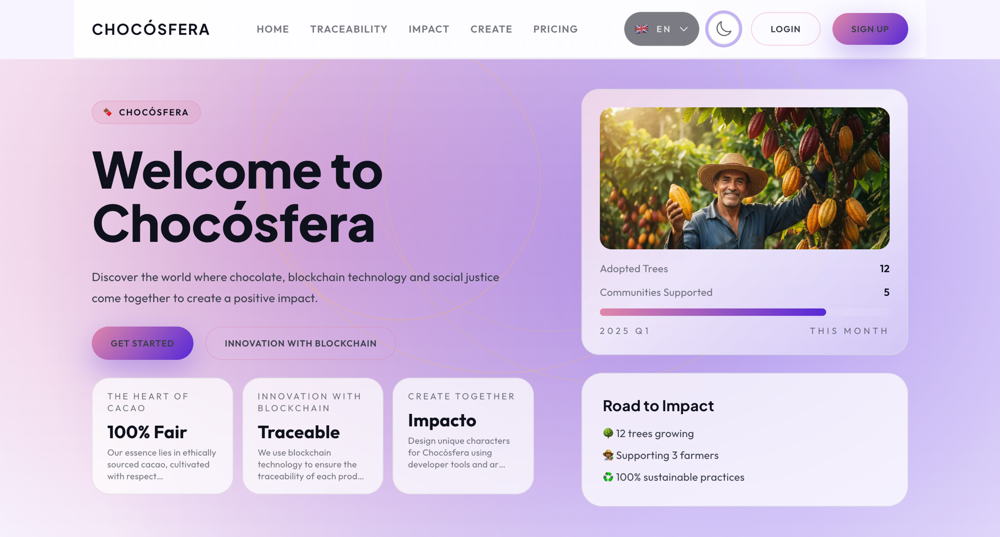
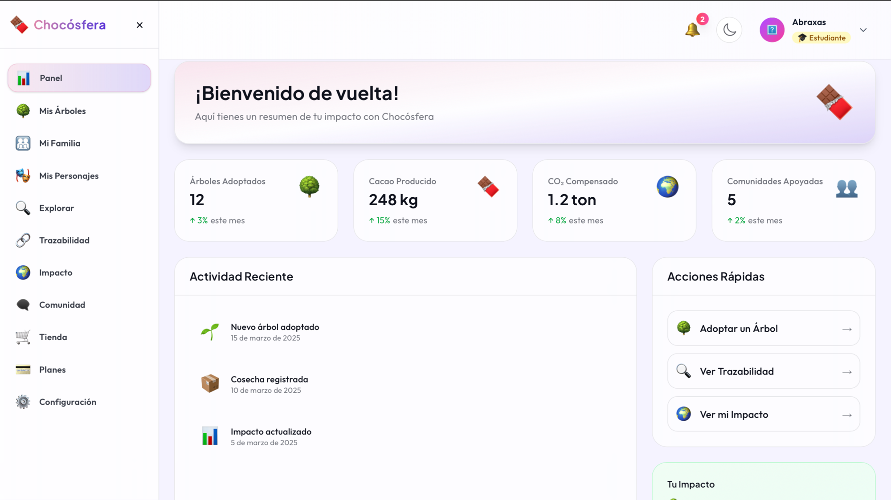
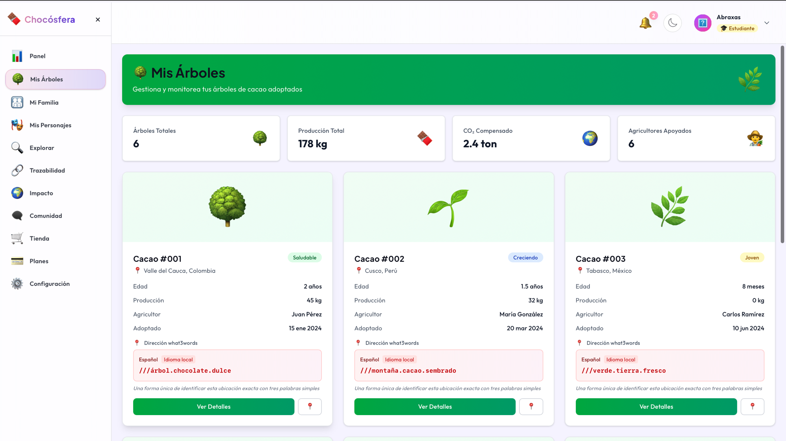
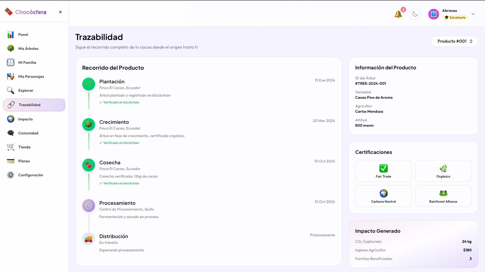
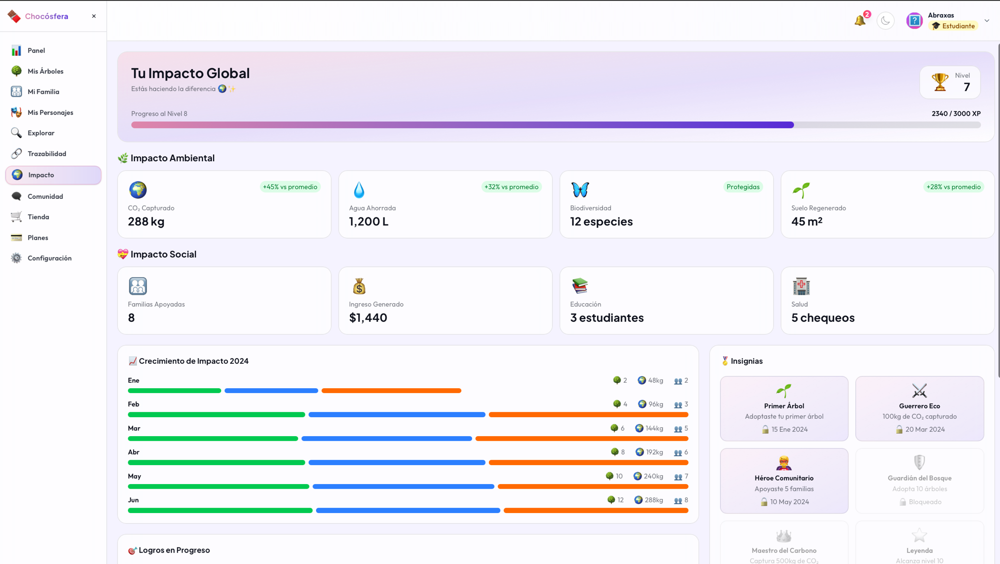
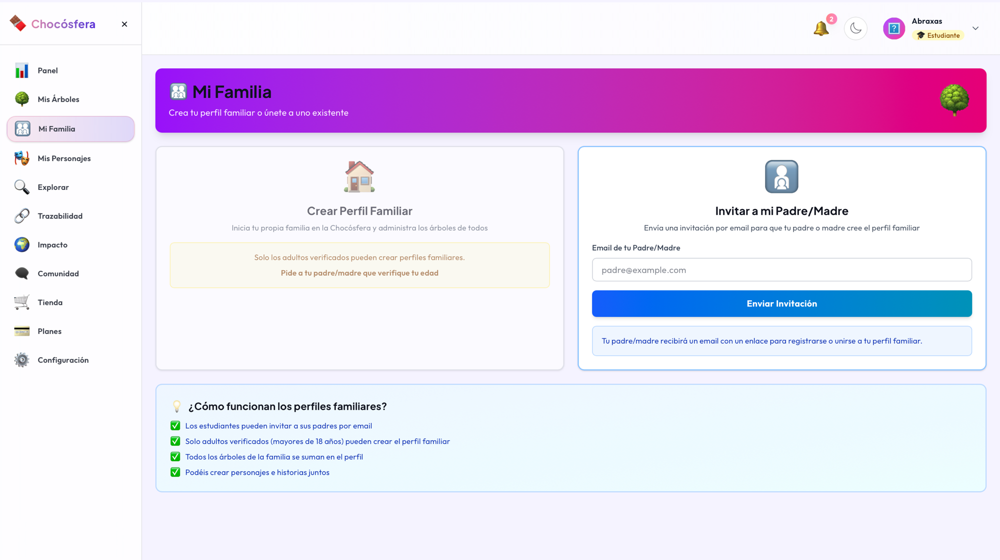
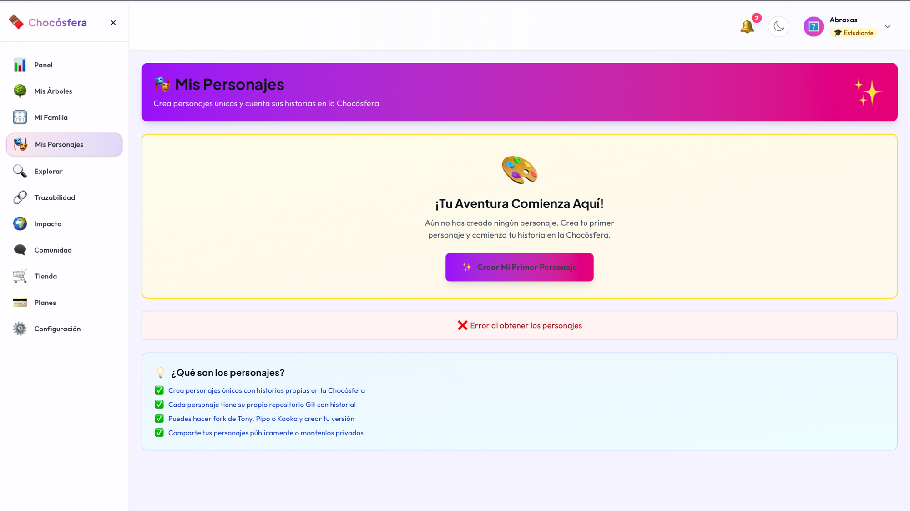
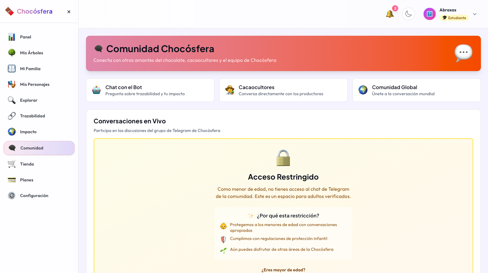
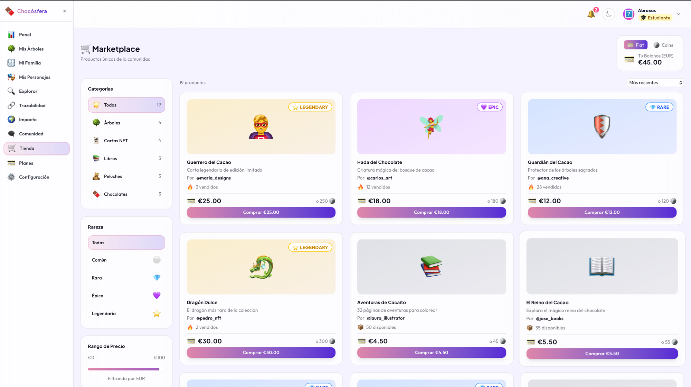

# Chocosfera

**Donde el chocolate, la tecnologia blockchain y la justicia social se unen para crear un impacto positivo.**

Chocosfera es una plataforma web que conecta a familias, productores de cacao y comunidades a traves de la trazabilidad blockchain, la creacion de personajes digitales y el comercio justo.

## Demo

**URL:** [http://vps23658.cubepath.net/es](http://vps23658.cubepath.net/es)

### Credenciales de prueba

| Usuario | Email | Password | Rol |
|---------|-------|----------|-----|
| Demo | `demo@mailsac.com` | `Chocosfera2026!` | Estudiante (menor) |
| Judge | `judge@mailsac.com` | `Chocosfera2026!` | Padre/Representante de Demo |

> **Sobre los roles:** Los estudiantes (menores) tienen acceso restringido al chat de Telegram de la comunidad, que es un espacio exclusivo para adultos verificados. El usuario Judge, como padre/representante, tiene acceso completo y administra el perfil de "Familia Hackathon" donde ambos comparten arboles e impacto.

## Screenshots

**Landing page**


**Dashboard principal**


**Mis Arboles - Adopcion de cacao**


**Trazabilidad blockchain**


**Impacto ambiental y social**


**Perfiles familiares**


**Personajes digitales**


**Comunidad Telegram**


**Marketplace**


## Funcionalidades principales

- **Trazabilidad blockchain** - Seguimiento transparente del cacao desde el productor hasta el consumidor
- **Personajes digitales** - Crea y comparte personajes unicos dentro del ecosistema
- **Perfiles familiares** - Experiencias colaborativas con relaciones padre-hijo y proteccion de menores
- **Impacto ambiental** - Adopcion de arboles, compensacion de carbono, apoyo a agricultores
- **Comunidad** - Integracion con Telegram, marketplace y storytelling
- **Multi-idioma** - Soporte para 9 idiomas (ES, EN, IT, FR, DE, PT, RO, JA, ZH)
- **Pagos** - Integracion con Stripe para Chococoins y marketplace
- **Gamificacion** - Insignias, niveles, XP y logros

## Stack tecnologico

- **Framework:** Next.js 16 (App Router + Turbopack)
- **Frontend:** React 19, TypeScript, TailwindCSS 4
- **Base de datos:** PostgreSQL (Prisma) + MongoDB
- **Autenticacion:** JWT con verificacion por email
- **Pagos:** Stripe
- **Email:** Mailersend
- **Bot:** Telegram (Telegraf)
- **i18n:** next-intl (9 idiomas)

## Despliegue en CubePath

La aplicacion esta desplegada en un **Cloud VPS de CubePath** en la region de Barcelona, Spain (eu-bcn-1).

### Infraestructura

- **VPS:** gp.nano (1 CPU, 2GB RAM, 40GB NVMe SSD)
- **OS:** Ubuntu 24
- **Runtime:** Node.js 22, PM2, Nginx
- **Databases:** PostgreSQL 16 + MongoDB 7.0 (instalados en el VPS)
- **Proteccion:** DDoS incluida

### Pasos de despliegue

Todo el despliegue se realizo via la **API REST de CubePath**:

1. `POST /projects/` - Crear proyecto
2. `POST /sshkey/create` - Registrar SSH key
3. `POST /vps/create/{project_id}` - Desplegar VPS con Ubuntu 24
4. Configurar servidor via SSH: Node.js, Nginx, PM2, PostgreSQL, MongoDB
5. Clonar repo, instalar deps, correr migraciones Prisma, build y arranque

```bash
git clone https://github.com/Chococoin/chocosfera.git
cd chocosfera
npm install
npx prisma generate
npx prisma migrate deploy
npm run build
pm2 start npm --name chocosfera -- start
```

## Desarrollo local

```bash
git clone https://github.com/Chococoin/chocosfera.git
cd chocosfera
npm install
cp .env.example .env.local  # Configurar credenciales
npx prisma generate
npx prisma migrate deploy
npm run dev
```

Abrir [http://localhost:3000](http://localhost:3000) en el navegador.

## Estructura del proyecto

```
app/              - Next.js App Router (paginas y API routes)
components/       - Componentes React reutilizables
lib/              - Logica de negocio (auth, email, Git, Stripe, MongoDB, Prisma)
types/            - Definiciones TypeScript
hooks/            - Custom React hooks
contexts/         - React contexts (AuthProvider)
messages/         - Archivos de traduccion i18n (9 idiomas)
prisma/           - Schema y migraciones de base de datos
public/           - Assets estaticos
```

## Hackathon CubePath 2026

Este proyecto participa en el [Hackathon CubePath 2026](https://github.com/midudev/hackaton-cubepath-2026) organizado por midudev.

---

Hecho con cacao y codigo.
